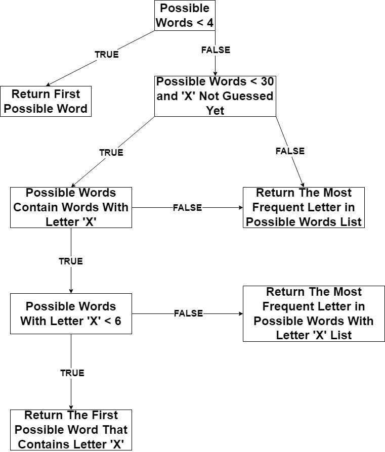

# Repository for AI Project 2.4

**Topic:** SS24 Assignment 2.4: [Guess the Word](https://kwarc.info/teaching/AISysProj/SS24/assignment-2.4.pdf) 

## Dependencies

- `Python` programming language with version `3.11` was used.
- `Counter` class was used from `collections` library to do necessary counting.

## Repository Structure

- `wordlist.txt` is a text file that contains every possible word.
- `simple-env.json` and `advanced-env.json` are the json files that contain the configurations for our agents in
simple and advanced environment.
- `test.py` is an algorithm to test the accuracy of word eliminations. By changing the feedback and guesses we can
see the reason of elimination of each word and the remaining possible words.
- `client-solutions` is a folder that contains necessary files such as:
    - `client.py` is the algorithm responsible with communication with the server.
    - `simple.py` is the algorithm that solves Guess the Word game in simple environment.
    - `advanced.py` is the algorithm that solves Guess the Word game in advanced environment.

## How to Run

Make sure there's a `wordlist.txt` file in project folder. After opening the terminal inside the project folder,
we can run the command:

`python3 client-solutions/simple.py simple-env.json` for simple environment

`python3 client-solutions/advanced.py advanced-env.json` for advanced environment

## The Problem

It is a word guessing game, very similar to Hangman but with a few changes in the rules. The server sends us a feedback and
the guesses made so far, according to this information we either send back a letter or try to guess the word. The goal is 
to make the most out of the provided information and make the least amount of guesses before finding the correct word.

There are 2 environments, simple and advanced, with some rule changes.

### Simple environment

- The words are represented by dashes where each dash corresponds to a letter in the word.
- After making a letter guess, all occurrences of that letter in the word are revealed.

### Advanced environment

- The words are always represented by 20 dashes, which hides their lengths.
- Only a single letter location can be revealed at a time, so we might need to guess a letter multiple times.

### How the word is chosen

- Words are chosen from the `wordlist.txt` file.
- Words that contain diacritics, hyphens or spaces are ignored.
- 50% of the time words that contain the letter `'X'` are picked and the other 50% of the time, words that
do not contain the letter `'X'` are picked.

## My Approach

First I loaded the words from the word list and cleaned the ones that contain diacritics, hyphens and spaces.

Then I started going through each word in the word list and I applied some filtering if statements. I added the words which 
survived the process into a list called `possible_words`. This filtering process was different for simple and advanced 
environments since they have different rules.

### Simple Environment Rules

- Before checking the letters individually, I checked if the word itself was already guessed. If it was, I skipped to the
next word.
- Then I checked if the word is same length as the feedback's dashes.
- If the word survives above checks, then I start checking letter by letter. If the feedback has a revealed letter position,
I check if the word also has the same letter in that position.
- Else if feedback has a dash where the word has a letter in that position and that letter is also in the guess list, then 
the word gets eliminated.

### Advanced Environment Rules

- I start by indexing the so far revealed letters. This is useful for the further eliminations.
- Then like in the simple environment, I check if the word is already guessed.
- If not, then I use the indexed positions to get the position of the right most letter. I eliminate words that are shorter
than this index.
- Then I start going through each guess;
  - if guess is a letter and not a word,
  - and if we guessed that letter more times than that letter's count in feedback,
  - and if the word has more times of that letter than the feedback has,
  - we eliminate that word.
- Then I check if there's an indexed letter and if so I start going through each position.
- If the word doesn't have same letter that feedback has in that position, I eliminate that word.

Words that survive these stages get added into possible words list.

### Guessing Word or Sending Letter

In both environments, if the possible words are more than 30, I calculate the most frequent letter in all possible words
and send the most frequent letter as my guess. But if the possible words are less than 4, I send the first possible word
as my guess. The number 30 and 4 was found by pure trial and error.

If there are more than or equal to 4 but less than 30 possible words, then I use the logic of how the words are chosen. 
Half the times words than contain letter 'X' are picked and the other half words that don't. So, if there are less than 
30 possible words and we haven't guessed the letter 'X' yet, I check if there are words with letter 'X' in them in the 
possible words list. If there are, and they're less than 6 (again trial and error), I send the first possible word that 
contains 'X' in it as my guess. Otherwise, I send the most frequent letter in the list of possible words that contain 'X'.

Here is a diagram to visualize the process better:

